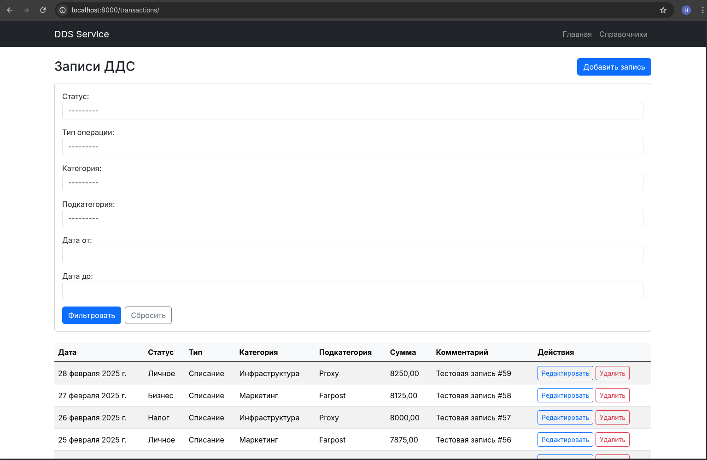
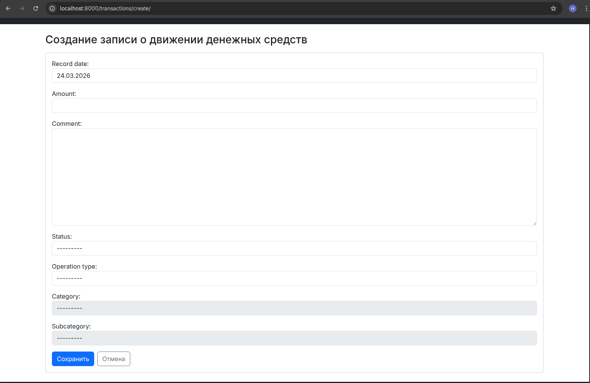
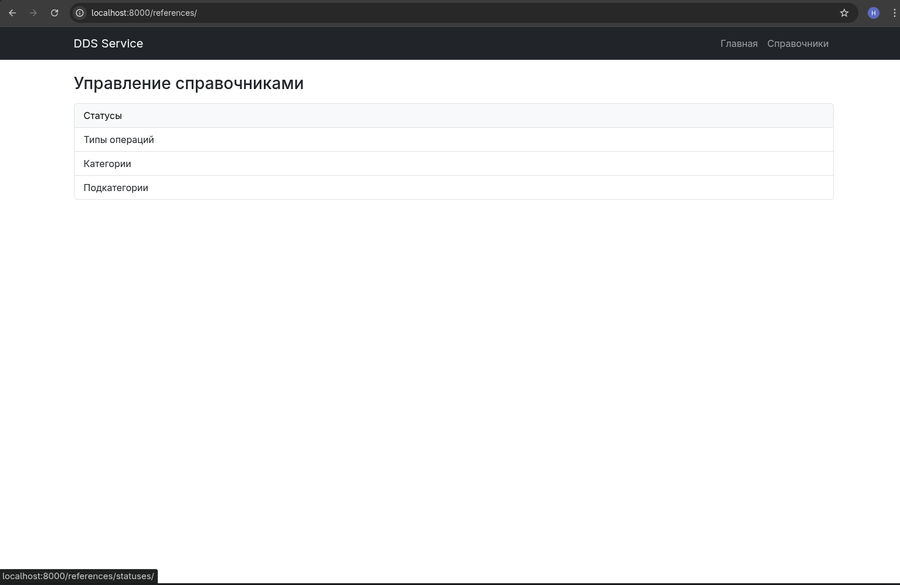
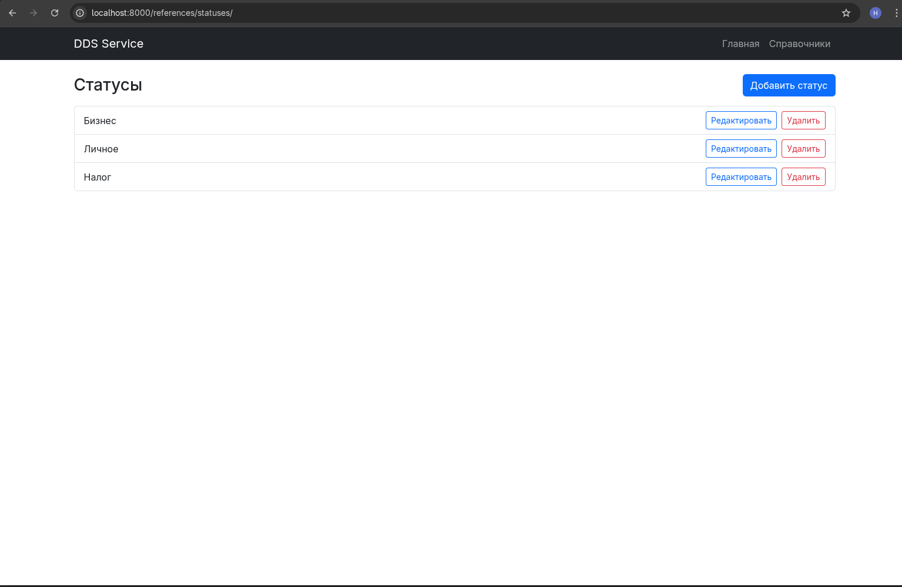
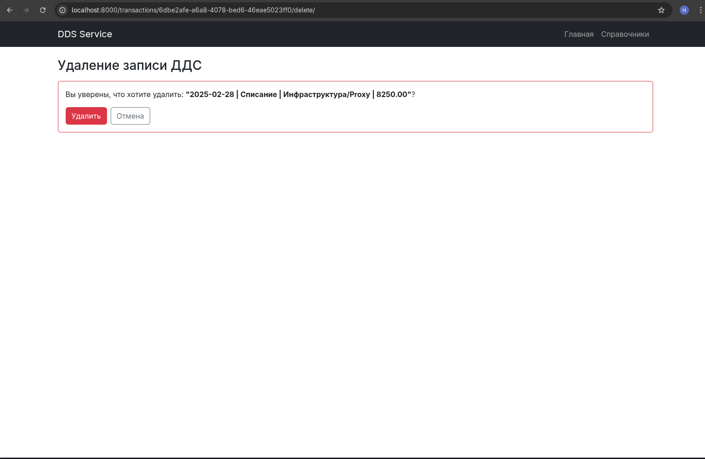
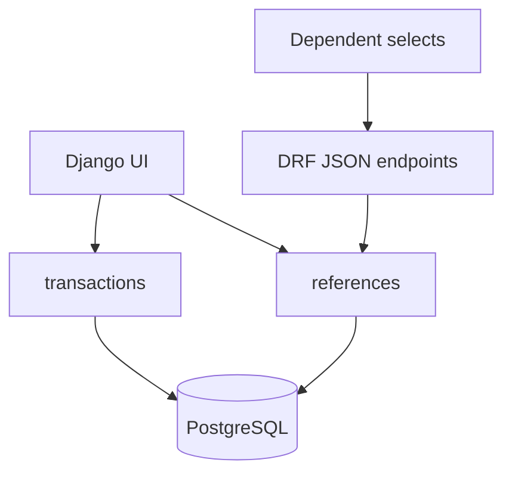

# Cashflow Management Service

[](https://github.com/HageGyakutai/dds-service/actions/workflows/ci.yml)
[](https://www.python.org/)
[](https://www.djangoproject.com/)
[](LICENSE)

Веб-сервис для учёта движения денежных средств компании: поступлений и списаний с привязкой к статусу, типу операции, категории и подкатегории.

Проект показывает полный путь небольшой бизнес-системы: от доменных правил и интерфейса пользователя до PostgreSQL, контейнеризации, автоматических тестов и CI.

## Бизнес-задача

Ручной учёт операций в таблицах быстро становится неудобным: появляются несогласованные категории, ошибки в классификации и сложности с поиском нужных записей.

Сервис решает эту задачу через:

- единый журнал поступлений и списаний;
- управляемые справочники статусов, типов, категорий и подкатегорий;
- фильтрацию операций по периоду и классификаторам;
- проверку связей `тип → категория → подкатегория` на сервере;
- простой русско- и англоязычный веб-интерфейс.

## Возможности

- создание, просмотр, редактирование и удаление операций;
- фильтрация по датам, статусу, типу, категории и подкатегории;
- пагинация журнала операций;
- CRUD-интерфейс для справочников;
- динамическая загрузка категорий и подкатегорий без перезагрузки страницы;
- защита удаления связанных справочников через `PROTECT`;
- UUID для доменных сущностей и `Decimal` для денежных значений;
- локализация интерфейса на русский и английский языки;
- healthcheck для проверки доступности приложения;
- seed-команды для быстрого заполнения демонстрационными данными.

## Демонстрация

### Журнал операций и фильтры



### Создание операции с зависимыми справочниками



<details>
<summary>Другие экраны</summary>

#### Управление справочниками



#### CRUD статусов



#### Подтверждение удаления



</details>

## Что демонстрирует проект

- моделирование предметной области средствами Django ORM;
- размещение бизнес-валидации на уровне формы и модели;
- работу с PostgreSQL и миграциями;
- серверный рендеринг Django Templates и небольшую JS-интеграцию;
- JSON endpoints на Django REST Framework для зависимых полей формы;
- воспроизводимый запуск через Docker Compose;
- автоматические проверки в GitHub Actions;
- тестирование ключевых пользовательских и негативных сценариев.

> Проект не позиционируется как публичный REST API. Основной интерфейс — серверное Django-приложение; DRF применяется для вспомогательных JSON endpoints.

## Архитектура

Приложение разделено на два домена:

- `transactions` — операции ДДС, фильтрация и пользовательские сценарии;
- `references` — статусы и иерархические классификаторы.



Ключевые связи:

```text
CashflowRecord
├── Status
├── OperationType
├── Category ────────> OperationType
└── SubCategory ─────> Category
```

Корректность иерархии проверяется дважды:

1. `CashflowRecordForm` ограничивает доступные значения и возвращает понятные ошибки пользователю.
2. `CashflowRecord.clean()` защищает доменное правило при сохранении модели вне веб-формы.

## Стек

- Python 3.13;
- Django 5.2, Django REST Framework, django-filter;
- PostgreSQL 16;
- Django Templates, Bootstrap, JavaScript;
- Pytest, pytest-django, MyPy, Black, Flake8, pre-commit;
- Docker, Docker Compose, uv;
- GitHub Actions.

## Быстрый запуск

Понадобятся Git, Docker и Docker Compose.

```bash
git clone https://github.com/HageGyakutai/dds-service.git
cd dds-service
cp .env.example .env
docker compose up --build
```

При старте контейнер автоматически:

1. ожидает готовности PostgreSQL;
2. применяет миграции;
3. создаёт начальные справочники;
4. создаёт администратора, если его ещё нет.

После запуска:

- приложение: <http://localhost:8000/>;
- справочники: <http://localhost:8000/references/>;
- healthcheck: <http://localhost:8000/health/>;
- Django Admin: <http://localhost:8000/admin/>.

Демонстрационные данные администратора находятся в `.env.example`. Перед любым развёртыванием вне локальной среды замените их вместе с `SECRET_KEY`.

Чтобы добавить 100 тестовых операций:

```bash
docker compose exec web uv run python manage.py seed_cashflow_records
```

Можно задать количество и начальную дату:

```bash
docker compose exec web uv run python manage.py seed_cashflow_records \
  --count 25 \
  --start-date 2026-01-01
```

Остановить проект и удалить контейнеры:

```bash
docker compose down
```

## Проверка качества

В репозитории 29 автоматических тестов. Они проверяют smoke-сценарии, CRUD операций, фильтрацию, пагинацию, зависимые поля и нарушение доменных связей.

```bash
uv sync --extra dev --locked
uv run black --check .
uv run flake8 .
uv run mypy .
uv run pytest
```

GitHub Actions выполняет эти проверки на каждом push и pull request с PostgreSQL 16.

## Основные маршруты

| Метод | Маршрут | Назначение |
|---|---|---|
| `GET` | `/` | журнал операций с фильтрами |
| `GET`, `POST` | `/transactions/create/` | создание операции |
| `GET`, `POST` | `/transactions/<uuid>/update/` | редактирование операции |
| `GET`, `POST` | `/transactions/<uuid>/delete/` | подтверждение и удаление |
| `GET` | `/references/` | управление справочниками |
| `GET` | `/transactions/api/categories/` | категории выбранного типа |
| `GET` | `/transactions/api/subcategories/` | подкатегории выбранной категории |
| `GET` | `/health/` | проверка доступности |
| `GET` | `/admin/` | Django Admin |

## Структура

```text
.
├── apps/
│   ├── references/       # справочники, модели, формы и CRUD
│   └── transactions/     # операции, фильтры и пользовательские сценарии
├── config/               # URL и модульные настройки Django
├── locale/               # переводы интерфейса
├── templates/            # серверные HTML-шаблоны
├── tests/                # интеграционные и доменные тесты
├── Dockerfile
├── docker-compose.yml
├── entrypoint.sh
└── pyproject.toml
```

## Ограничения и возможное развитие

Это законченный учебный MVP, а не production-система финансового учёта. В текущую версию намеренно не входят авторизация по ролям, аудит изменений, экспорт отчётов, публичный REST API и production WSGI-конфигурация.

Следующие логичные шаги развития:

- роли и разграничение доступа;
- журнал аудита изменений;
- экспорт в CSV/XLSX;
- аналитические отчёты;
- OpenAPI-контракт и полноценный REST API;
- Gunicorn, HTTPS и deployment-конфигурация.

## Автор

Сергей Запольских — Python backend-разработчик.

[GitHub](https://github.com/HageGyakutai)

## Лицензия

Проект распространяется по лицензии [MIT](LICENSE).